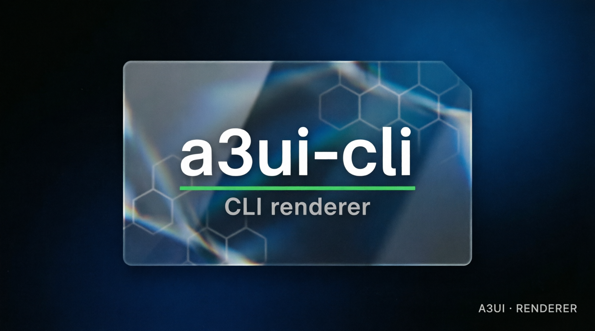

# a3ui-cli — textual A3UI renderer



## What it is

A Python 3.11+ standard-library-only command-line renderer and protocol honesty bench. It validates the seven-field surface tuple, lifecycle, DataRef re-binding, opaque `x-*` extensions, marks, provenance, age, and CTA state.

## What it is not

It is not a product UI, not a graphical renderer, and not a copy of another A3UI implementation. It reads the normative spec and shared fixtures by path.

## Status

- **VERIFIED:** CL-001..CL-012, 13 pytest tests, CLI smoke behavior, seven-primitive closure, and shared fixture semantics.
- **UNVERIFIED:** downstream adoption and terminal presentation outside the deterministic text format.

## Get it

```bash
git clone https://github.com/valeriobitzone-png/a3ui-cli.git
cd a3ui-cli
# Requirements: Python 3.11+ and pytest for the test gate.
# The conformance fixtures/spec are a pinned, documented sibling dependency:
git clone https://github.com/valeriobitzone-png/a3.git ../a3
git -C ../a3 checkout closeout-v1.0
```

Structure: `a3ui_cli/core.py`, `a3ui_cli/render.py`, `a3ui_cli/__main__.py`, and `tests/`. The implementation has no runtime dependencies.

## Prove it

```bash
python3 -m pytest -q
python3 -m a3ui_cli render ../a3/conformance/a3ui/fixtures/calendar-contradicted.json
```

Expected result: tests pass; the CLI exits 0 for a valid surface and exits 1 with `reject:` for invalid input.

## Integrate it

Use `python3 -m a3ui_cli render <surface.json>` as a textual bench for your own surfaces. For the shared conformance inputs, keep the documented `../a3` checkout at `closeout-v1.0`; read `../a3/spec/SPEC_A3UI.md`, preserve provenance and UNKNOWN-first semantics, and keep the seven primitive catalog closed.

## License

Implementation code is Apache-2.0. The consumed A3UI specification and schemas are CC BY 4.0 in the source A3 repository.

## Provenance

Measured: pytest results, CLI exit codes, primitive inventory, and path-based fixture reads. The textual layout is a renderer decision; it is not evidence about the underlying world.
